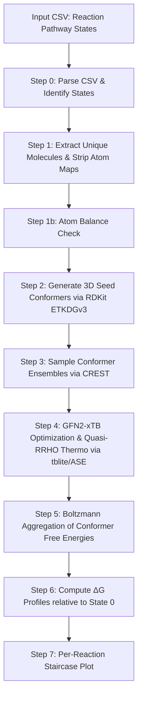

# Simple Reaction Thermo

A lightweight, self-contained Python pipeline for calculating and visualizing free energy profiles ($\Delta G$) at the semiempirical level of theory for multi-step reaction pathways from SMILES.

---

## Workflow Overview



Steps 3 and 4 can run **sequentially** (default) or **in parallel** across molecules.

---

## Installation

```bash
pip install rdkit ase tblite matplotlib numpy
```

**Optional:** [CREST](https://github.com/crest-lab/crest) for conformer ensemble sampling. If not found, the pipeline falls back to the single RDKit seed conformer.

---

## Usage

```bash
python fe_pipeline.py reactions.csv --solvent none --crest-binary /path/to/crest --output-dir results/
```

**Parallel execution** (4 molecules simultaneously, 2 cores each — requires 8 cores):
```bash
python fe_pipeline.py reactions.csv --solvent none --crest-binary /path/to/crest --output-dir results/ --parallel --n-workers 4 --n-cores-crest 2
```

**Core budget rule:** `n_workers × n_cores_crest ≤ total available cores`.

---

## Input Format

CSV with one reaction per row. States are separated by `>>`, molecules within a state by `.`. Atom-mapped SMILES are supported and stripped automatically.

```csv
# reaction_id,pathway
RXN000001,"C=CC=C.C=C.[H][H]>>C1=CCCCC1.[H][H]>>C1CCCCC1"
```

Every state must be **atom-balanced** — Step 1b checks this before any QM runs and reports exactly which atoms are missing or gained.

---

## Outputs

- **Per-reaction PNG plots** saved as `{output_dir}/{rxn_id}.png`, one file per reaction
- **Console log** with full per-step diagnostics: atom inventory, optimized energies, vibrational frequencies, Boltzmann weights, and $\Delta G$ profile
- **Optimized geometries** in XYZ format (if `--save-geoms` is set), named by sanitized SMILES + hash
- **Failure report** at `{output_dir}/failed_reactions.txt`, written whenever any reaction could not be completed (see below)

---

## Error Handling

The pipeline is designed to process large batches without stopping on individual failures. Every step catches exceptions at the per-reaction or per-molecule level, logs the reason, and continues with the remaining input. A `failed_reactions.txt` report is written at the end of every run that had at least one failure.

### What is caught and where

| Step | Failure type | Effect |
|---|---|---|
| Step 0 | Invalid SMILES (e.g. `[ClH2-]`, wrong valence, typo) | Reaction skipped entirely; no compute time wasted |
| Step 2 | RDKit 3D embedding fails (unusual connectivity) | Molecule skipped; any reaction requiring it is skipped in Step 6 |
| Step 4 | GFN2-xTB geometry optimisation or Hessian fails | Molecule skipped; reason recorded with full exception message |
| Step 6 | State_0 (reference) has missing G values | Reaction skipped; remaining reactions unaffected |
| Any step | Unexpected exception | Caught by `run_pipeline_safe`; report written; process exits cleanly |

### Failure report format

`failed_reactions.txt` contains three sections, each only present if there were failures of that type:

```
Simple Reaction Thermo -- Failure Report
============================================================

SMILES PARSE ERRORS -- Step 0 (1)
------------------------------------------------------------
  RXN000025
    Reason : Invalid SMILES in State_3: Cannot parse state SMILES:
             'COc1nnc(s1)N=C=O.[ClH2-].[Cl+]'

xTB COMPUTATION FAILURES -- Step 4 (1)
------------------------------------------------------------
  SMILES : N#[C][Na]
  Reason : xTB failed for conformer 0: RuntimeError: SCF did not converge

REACTIONS WITHOUT PLOTS -- Step 6 (1)
------------------------------------------------------------
  RXN000004
    Reason : State_0 (reference) could not be computed.
             Failed molecules: N#[C][Na]: xTB failed ...
```

### Common failure causes and fixes

**Invalid SMILES valence** — e.g. `[ClH2-]` (Cl with 2 H and negative charge exceeds permitted valence). Verify with:
```bash
python -c "from rdkit import Chem; print(Chem.MolFromSmiles('YOUR_SMILES'))"
```

**Covalent representation of ionic species** — e.g. `C(#N)[Na]` encodes a covalent C–Na bond which xTB cannot handle. Use the ionic form instead: `[Na+].[C-]#N`.

**Unbalanced states** — missing a leaving group, solvent molecule, or counter-ion in one state causes the energy of that state to be wrong by hundreds of kcal/mol. Step 1b will flag this before any QM runs. Every state must have the same total atom count as the previous one.

---

## Technical Details

### Atom Balance Check (Step 1b)
Every state is expanded to explicit hydrogens and its atom inventory compared against the previous state. Any discrepancy is reported as a `WARNING` with the exact atoms gained or lost. This is purely diagnostic and does not modify the input — but any energies downstream of an unbalanced step should not be trusted.

### Thermochemistry & Grimme's Quasi-RRHO
Free energy for each conformer is computed as:

$$G = E_{\text{elec}} + \text{ZPVE} + H_{\text{vib}} + H_{\text{trans}} + H_{\text{rot}} + pV - T(S_{\text{vib}} + S_{\text{trans}} + S_{\text{rot}})$$

Vibrational entropy uses Grimme's quasi-RRHO interpolation (Grimme, *Chem. Eur. J.* 2012, 18, 9955):

$$S_{\text{vib}} = w \cdot S_{\text{HO}} + (1 - w) \cdot S_{\text{FR}}, \quad w = \frac{1}{1 + (\omega_0/\nu)^4}$$

Modes below $\omega_0 = 100\ \text{cm}^{-1}$ are smoothly transitioned to a free-rotor model to avoid entropy singularities. Translational and rotational contributions are computed from molecular mass and the inertia tensor. Linear molecules and diatomics (including $H_2$) are handled as a special case with a single moment of inertia.

### Parallel Execution
`ProcessPoolExecutor` dispatches one worker process per unique molecule. Each worker runs Steps 3+4 in full isolation: its own CREST subprocess, its own xTB calculations, and its own temporary directory for ASE `Vibrations` cache files. This last point is critical — without per-worker temp directories, parallel processes write `vib_*.json` files to the same working directory simultaneously, causing index-out-of-bounds errors when frequencies are read back. Results are merged before Step 5, which remains sequential.

### Accuracy Expectations

For organic reactions with GFN2-xTB + quasi-RRHO (no CREST, single conformer):

| Property | Typical error vs experiment |
|---|---|
| Relative conformer energies | ~0.5–1 kcal/mol |
| Reaction $\Delta G$ | ~2–5 kcal/mol |
| Qualitative profile shape | Usually correct |

For improved accuracy: run with CREST to sample conformer ensembles properly, use implicit solvent (ALPB) for any reaction involving polar intermediates or charged species, and consider DFT single-point corrections (e.g. r2SCAN-3c) on the CREST-selected conformers.