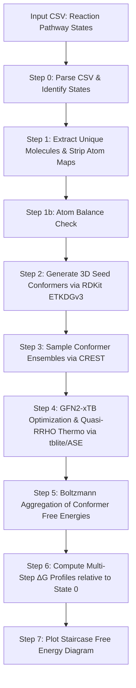

# Simple Reaction Thermo

A lightweight, self-contained, Python pipeline for calculating and visualizing free energy profiles ($\Delta G$) at the semiempirical level of theory for multi-step reaction pathways from SMILES.

The pipeline performs atom-balance validation, 3D conformer generation, optional conformer ensemble sampling, quantum-chemical geometry optimization and thermochemistry calculations, Boltzmann averaging, and automated plotting of reaction staircase diagrams. Geometry optimization and conformer sampling can optionally be parallelized across molecules.

---

## Workflow Overview



Steps 3 and 4 can be executed either **sequentially** (one molecule at a time) or **in parallel** (multiple molecules processed simultaneously across CPU processes), depending on the `parallel` argument.

---

## Features

- **Single-File Execution**: The entire pipeline is implemented in [fe_pipeline.py](file:///home/amint/workspace/simple_reaction_thermo/fe_pipeline.py).
- **Atom Balance Validation**: Automatically checks that every reaction state is atom-balanced (including implicit hydrogens) before running any expensive calculations, and reports exactly which atoms are gained or lost between states if a mismatch is found.
- **Flexible Conformer Sampling**: Employs **CREST** (GFN2-xTB + ALPB implicit solvent) to sample low-energy conformer ensembles. If CREST is not installed, it gracefully degrades to using the initial RDKit 3D conformer.
- **Accurate Thermochemistry**: Geometry optimization and vibrational frequency calculations are performed using the tight-binding semi-empirical **GFN2-xTB** method (via `tblite` and `ASE`).
- **Grimme's Quasi-RRHO Correction**: Entropic contributions of low-frequency vibrations are treated using Grimme's quasi-rigid-rotor harmonic-oscillator (quasi-RRHO) interpolation model.
- **Boltzmann Aggregation**: Computes a single effective free energy ($G_{\text{eff}}$) for each species by taking the Boltzmann weighted average over all sampled conformers:
  $$G_{\text{eff}} = -RT \ln \sum_i e^{-G_i / RT}$$
- **Gas Phase or Implicit Solvent**: Pass `none` as the solvent argument to run fully in the gas phase (skips ALPB in both CREST and xTB); any solvent name supported by xTB (`water`, `acetonitrile`, `methanol`, `dmso`, etc.) can otherwise be specified.
- **Optional Parallel Execution**: Steps 3+4 can be distributed across multiple molecules simultaneously using `ProcessPoolExecutor`, since every unique molecule is independent. Sequential execution remains the default and is unaffected.
- **Automatic Visualization**: Generates publication-ready staircase plots with color-coded free energy steps (green for exergonic, red for endergonic transitions) and labeled reaction states.

---

## Installation & Requirements

Ensure you have Python 3.9+ installed. The pipeline requires the following dependencies:

```bash
pip install rdkit ase tblite matplotlib numpy
```

### Optional External Binaries
For conformer ensemble sampling, the **CREST** binary must be installed and available on your system `PATH` (or referenced via an explicit path):
- [CREST Github Repository](https://github.com/crest-lab/crest)

If CREST is not found, the script will skip the metadynamics sampling in Step 3 and calculate the properties of the single 3D seed conformer generated by RDKit.

---

## Usage

### 1. Prepare Input CSV
Create a CSV file representing your reaction pathways. Use `>>` to separate reaction states, and `.` to separate different molecules within the same state. Comment lines beginning with `#` are ignored.

Example (`reactions.csv`):
```csv
# reaction_id,pathway
RXN000001,"[CH3:1][Br:2]>>[CH3:1].[Br-:2]>>[CH3:1][OH:3]"
```

> **Important**: every state in a pathway must be atom-balanced (same total count of each element, including implicit hydrogens). Step 1b checks this automatically and will print a `WARNING` for any unbalanced transition — any energies computed downstream of an unbalanced state should not be trusted.

### 2. Run the Pipeline

```bash
python fe_pipeline.py reactions.csv [solvent] [crest_binary] [parallel] [n_workers] [n_cores_crest]
```

| Argument | Position | Default | Description |
|---|---|---|---|
| `csv_path` | 1 (required) | — | Path to the input CSV file |
| `solvent` | 2 | `water` | Implicit solvent name for CREST/xTB (ALPB), or `none` for gas phase |
| `crest_binary` | 3 | `crest` | Path or name of the CREST executable |
| `parallel` | 4 | `False` | `true`/`1`/`yes` to enable parallel execution of Steps 3+4 across molecules |
| `n_workers` | 5 | `4` | Number of molecules processed simultaneously (parallel mode only) |
| `n_cores_crest` | 6 | `2` | CPU cores allocated to each individual CREST call |

**Sequential (default), implicit water solvent:**
```bash
python fe_pipeline.py reactions.csv water /path/to/crest
```

**Sequential, gas phase:**
```bash
python fe_pipeline.py reactions.csv none /path/to/crest
```

**Parallel execution** — 4 molecules processed simultaneously, 2 CPU cores per CREST call (requires 8 cores total):
```bash
python fe_pipeline.py reactions.csv none /path/to/crest true 4 2
```

> **Core budget rule**: `n_workers × n_cores_crest` should not exceed the number of physical cores available, or CREST instances will compete for CPU and slow each other down.

### 3. Outputs
- **Console Log**: Detailed stdout reporting progress, atom-balance diagnostics, optimized energies, vibrational frequencies, Boltzmann weights of conformers, and final $\Delta G$ profiles.
- **Free Energy Profile Plots**: A single staircase diagram (`free_energy_profile.png`) containing one subplot per reaction in the input CSV.

---

## Technical Details

### Atom Balance Check (Step 1b)
Before any 3D structures are generated, every state in every reaction is converted to an explicit-hydrogen atom count and compared against the previous state. Any discrepancy (e.g. a missing $H_2$, $H_2O$, or counter-ion) is reported as a `WARNING` showing exactly which atoms were gained or lost. This is a purely diagnostic step — it does not modify the input — and is intended to catch incorrectly specified reaction strings before expensive QM calculations are run on them.

### Thermochemistry & Grimme's Quasi-RRHO
The thermochemistry block calculates the absolute free energy $G$ for each conformer:
$$G = E_{\text{elec}} + \text{ZPVE} + H_{\text{vib}} + H_{\text{trans}} + H_{\text{rot}} + pV - T(S_{\text{vib}} + S_{\text{trans}} + S_{\text{rot}})$$

- **$E_{\text{elec}}$**: Potential energy from the GFN2-xTB self-consistent charge calculation.
- **Vibrational Entropy ($S_{\text{vib}}$)**: Interpolated using Grimme's quasi-RRHO method:
  $$S_{\text{vib}} = w \cdot S_{\text{HO}} + (1 - w) \cdot S_{\text{FR}}$$
  where low-frequency modes are smoothly transitioned to a free-rotor model ($S_{\text{FR}}$) below a cut-off threshold of $100\text{ cm}^{-1}$ to avoid singularities in entropy calculations.
- **Translational & Rotational contributions**: Calculated from standard statistical thermodynamics using molecular weights and the calculated inertia tensor. Linear molecules (including diatomics such as $H_2$) are handled as a special case with a single rotational degree of freedom.

### Parallel Execution Model
When `parallel=True`, the pipeline dispatches one independent worker process per unique molecule using `concurrent.futures.ProcessPoolExecutor`. Each worker runs Steps 3 (CREST sampling) and 4 (GFN2-xTB optimization + thermochemistry) for a single molecule in isolation, since molecules share no state at this stage of the pipeline. Results are collected as they complete and merged before proceeding to Step 5 (Boltzmann aggregation), which remains sequential. Sequential mode (`parallel=False`, the default) runs Steps 3 and 4 across all molecules in a single process, exactly as in earlier versions of the pipeline.